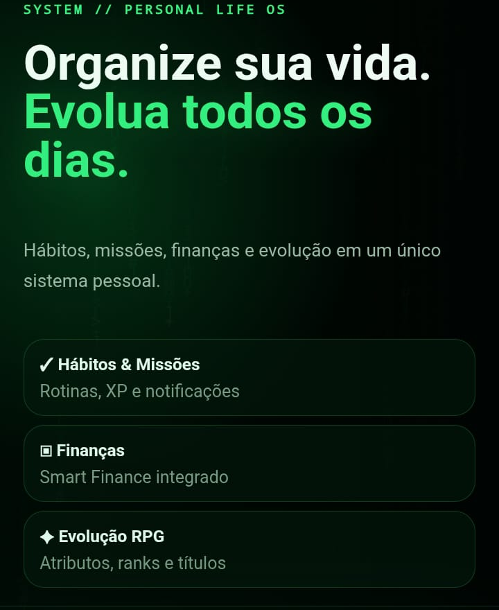
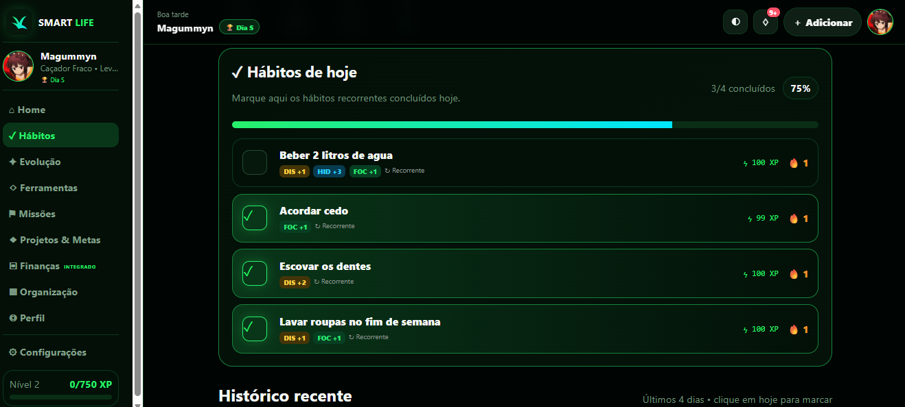

  

<h1 align="center">Smart Life v0.5.0</h1>

  <strong>Sua rotina transformada em uma jornada de evolução.</strong> 
  Hábitos, missões, projetos, organização, IA e finanças em um só aplicativo.

  🟢 Local e privado &nbsp;•&nbsp; 🎮 Gamificado &nbsp;•&nbsp; 📱 Android e computador &nbsp;•&nbsp; 🤖 Gemini opcional

---

## ✨ O que é o Smart Life

O **Smart Life** é um organizador pessoal gamificado. Cada hábito e missão concluída gera XP, desenvolve atributos e faz o personagem evoluir de acordo com o nível real do usuário.

### Principais recursos

- **Hábitos e Planner:** rotinas recorrentes, histórico, sequência, XP e atributos.
- **Missões:** abas Abertas e Concluídas, histórico e missões personalizadas.
- **Evolução RPG:** personagem, nível, rank, títulos e status.
- **Projetos & Metas:** projetos comuns, metas numéricas e financeiras.
- **Organização estilo Notion:** páginas formatadas, modelos, listas, tarefas, busca e editor completo.
- **Registros & Automações:** ações reais concedem até 3 pontos diários por atributo e podem atualizar hábitos ou missões.
- **Agenda semanal:** hábitos, missões e projetos organizados por dia e horário.
- **Busca global e lixeira:** encontre qualquer item e restaure conteúdos removidos por até 30 dias.
- **Smart Finance integrado:** receitas, despesas, cartões, faturas, empréstimos e recorrências.
- **Central IA:** missões, planejamento de metas, organização semanal e revisão semanal com Gemini.
- **Backup protegido:** no Android é salvo diretamente em `Downloads`; não inclui chaves da API ou sincronização.

## 📱 Visão do aplicativo

<table>
  <tr>
    <td align="center" width="34%"><strong>Apresentação no celular</strong></td>
    <td align="center" width="66%"><strong>Hábitos no computador</strong></td>
  </tr>
  <tr>
    <td align="center"></td>
    <td align="center"></td>
  </tr>
</table>

## ⚔️ Evolução visual do personagem

O personagem exibido na aba **Evolução** muda automaticamente conforme o nível.

<table>
  <tr>
    <td align="center"><strong>Níveis 1–10</strong> Caçador Fraco</td>
    <td align="center"><strong>Níveis 11–20</strong> Despertando</td>
    <td align="center"><strong>Níveis 21–39</strong> Caçador de Elite</td>
    <td align="center"><strong>Nível 40+</strong> Monarca das Sombras</td>
  </tr>
  <tr>
    <td></td>
    <td></td>
    <td></td>
    <td></td>
  </tr>
</table>

## 🗂️ Estrutura do repositório

- `Arquivos principais`: código usado pelo GitHub Actions e pelo APK.
- `.github/workflows`: compilação automática do Android.
- `docs/images`: imagens exibidas neste README.
- `PLAY-STORE.md`: preparação do arquivo AAB assinado para publicação.
- `SUPABASE-SETUP.sql`: estrutura opcional da sincronização criptografada.
- `Arquivos GitHub (Ignore)`: históricos e dados locais que não devem ser enviados.
- `Iniciar Aplicação.bat`: abre o aplicativo localmente após baixar ou clonar o repositório.
- `Enviar para GitHub.bat`: inicializa, atualiza e envia o repositório.

## 💻 Usar no computador

No pacote completo, abra a pasta `Arquivos Computador` e execute `Iniciar Aplicação.bat`.

Se você baixou ou clonou somente o repositório do GitHub, execute o `Iniciar Aplicação.bat` localizado na raiz do repositório. Ele abre diretamente `Arquivos principais/www/index.html`.

Os dados ficam salvos localmente no navegador do dispositivo. Para trocar de computador ou instalar uma versão nova, use o backup do próprio Smart Life.

## 🚀 Enviar para o GitHub

1. Extraia o ZIP completo.
2. Execute `Enviar para GitHub.bat` na pasta principal do pacote.
3. Na primeira execução, informe nome, e-mail e a URL do repositório.
4. Aguarde a mensagem **ENVIO CONCLUÍDO COM SUCESSO**.

O mesmo arquivo também está disponível dentro de `Arquivos GitHub`.

## 📱 Gerar o APK

Antes da primeira compilação assinada, siga [Criar a assinatura Android diretamente no GitHub](ASSINATURA-GITHUB.md). Esse procedimento é feito uma única vez e permite atualizar as próximas versões sem conflito de pacote.

Ao enviar a versão para a branch `main`, o GitHub Actions inicia a compilação automaticamente:

1. Abra a aba **Actions** do repositório.
2. Aguarde a execução **Build Android APK** terminar.
3. Baixe o artefato **Smart-Life-APK-v0.5.0**. Dentro dele estará o arquivo `Smart-Life-v0.5.0.apk`.

O botão **Run workflow** continua disponível apenas para refazer manualmente uma compilação.

## 🔒 Privacidade

- Login, perfil e progresso permanecem locais.
- O pacote é distribuído limpo, sem bancos, backups ou lançamentos financeiros pessoais.
- Dados financeiros pessoais não fazem parte de `Arquivos principais`.
- A chave Gemini não é incluída no backup.
- Credenciais e senha da sincronização online não são incluídas no backup.
- A sincronização online é opcional, desativada por padrão e criptografada antes do envio.
- A IA só recebe os grupos de dados autorizados nas Configurações.
- Sugestões da IA precisam de confirmação antes de alterar o aplicativo.

## 🆕 Novidades v0.5.0

- As notificações Android agora usam o símbolo próprio do Smart Life no lugar do ícone genérico de informação.
- O ícone foi criado no formato monocromático exigido pela barra de status do Android.
- A cor de destaque das notificações acompanha o verde principal do aplicativo.
- Lembretes de hábitos, notificações de teste, resumo diário e lembretes adiados usam a mesma identidade.
- Os workflows de APK e AAB copiam automaticamente o recurso visual para cada nova compilação.
- O README ganhou uma apresentação visual enxuta com telas relevantes do celular e do computador.

## Histórico v0.4.9

- No APK, **Exportar backup** grava um arquivo real diretamente na pasta pública `Downloads`.
- O app só confirma o download depois que o Android termina de salvar o arquivo.
- O nome segue o padrão `smart-life-backup-AAAA-MM-DD.smartlife.json`.
- Se já existir um arquivo com o mesmo nome, o Android preserva as cópias.
- No computador, a exportação continua usando o download normal do navegador.
- A integração nativa é instalada automaticamente nos builds de APK e AAB.
- O APK e o artefato do GitHub recebem automaticamente o número informado no `package.json`.
- O backup continua protegido, sem chave Gemini e sem credenciais da sincronização.

## Histórico v0.4.8

- Metas financeiras e numéricas mantêm a porcentagem baseada no valor atual e final.
- Marcar ou desmarcar itens do checklist não altera mais o progresso principal do projeto.
- O antigo “Etapas e marcos” foi renomeado para **Checklist do projeto** e ganhou progresso próprio.
- Cada projeto exibe somente o seu checklist, eliminando a repetição de itens no primeiro card.
- Registros reais concedem +1 no atributo correspondente, com limite de 3 por atributo a cada dia.

## Histórico v0.4.7

- Ferramentas passaram a ser **Registros & Automações**.
- Regras personalizadas permitem que registros reais avancem hábitos ou missões.
- Agenda semanal reúne hábitos, missões e projetos, com data, horário e lembrete.
- Busca global encontra hábitos, missões, projetos, páginas e lançamentos financeiros.
- Lixeira permite restaurar itens principais por até 30 dias.
- Projetos ganharam checklists editáveis.
- Revisão semanal local mostra resultados e também pode usar o Gemini com confirmação.
- Notificações Android ganharam ações para concluir ou adiar hábitos, resumo diário e preferências.
- Smart Life Online oferece sincronização opcional criptografada via Supabase.
- Workflow adicional gera um AAB assinado para a Play Store quando os segredos forem configurados.
- A Organização continua local e independente, sem conexão online obrigatória.

## Histórico v0.4.6

- Organização reformulada com editor rico, busca, ícones e modelos de página.
- Ferramentas podem avançar hábitos ou missões por quantidade e concluir a meta automaticamente.
- Registros de água identificam hábitos relacionados e interpretam metas como “2 litros”.
- Objetivos escolhidos no primeiro acesso podem ser atualizados sem apagar o progresso.
- Hábitos e missões ganharam controles visíveis de edição e exclusão.
- Todos os itens do painel do dia abrem o destino exato e recebem destaque visual.
- Filtros de receitas, despesas e empréstimos foram reforçados para desktop e celular.

## Histórico v0.4.5

- Os filtros Todas, Pendentes e Pagas agora funcionam nas parcelas de empréstimos.
- Parcelas vencidas ou próximas do vencimento são incluídas corretamente em Pendentes.
- O botão de parcela passou a exibir “Marcar como paga”.
- A aba Ferramentas deixou de criar registros genéricos e ganhou recursos próprios.
- Estudos agora possui Pomodoro de 25 minutos, sessões e histórico.
- Nutrição ganhou controle diário de água, meta e registro de refeições.
- Autocuidado ganhou checklist de rotinas e histórico.
- Exercícios ganhou registro de treino, duração, meta semanal e histórico.
- Sono calcula a duração pelos horários, registra qualidade e possui meta diária.
- O atalho Finanças em Ferramentas abre o módulo financeiro verdadeiro.

## Histórico v0.4.4

- O Coordenador Smart agora mantém uma conversa real com o Gemini.
- As respostas analisam a conversa e os grupos de dados autorizados pelo usuário.
- O Coordenador pode responder sem criar missões e fazer perguntas quando faltarem detalhes.
- Missões sugeridas na conversa possuem confirmação individual antes de entrar no plano.
- O antigo sistema local que apenas separava o texto em missões foi removido.
- “Missões para hoje” agora exibe uma revisão antes de adicionar qualquer item.
- A conversa atual não é incluída no backup e permanece somente durante a sessão.

## Histórico v0.4.3

- As execuções automáticas do GitHub Actions agora exibem o nome da versão atual.
- O artefato do APK acompanha a mesma identificação da versão.
- O projeto e o APK são gerados sem dados financeiros ou backups incorporados.
- O APK solicita a permissão de notificações após o login de um perfil configurado ou ao concluir as perguntas iniciais.

## Histórico v0.4.2

- Alterações de nome exibido e usuário agora são gravadas também na conta local ativa.
- Nome, usuário, iniciais e foto continuam iguais depois de fechar e reabrir o aplicativo.
- No celular e no APK, o formulário de login aparece antes da apresentação do Smart Life.
- A apresentação continua logo abaixo do acesso, sem alterar o layout de computador.
- A mesma logo oficial da tela de login agora aparece na navegação, inicialização e favicon do sistema.

## Histórico v0.4.1

- Títulos de hábitos limitados a 60 caracteres e descrições a 300 caracteres.
- Textos contínuos agora quebram linha dentro dos cards sem ultrapassar a tela.
- “Hábitos de hoje” e “Histórico recente” adaptados para celulares estreitos.
- Hábitos antigos acima do limite são normalizados ao carregar, sem afetar XP ou histórico.
- A conta permanece conectada neste dispositivo até o usuário tocar em **Sair da conta**.
- O botão Voltar do Android fecha modais/menus e retorna pelas telas anteriores do aplicativo.
- Backups de outra identidade agora mostram uma comparação e vinculam os dados à conta correta após confirmação.
- A importação é bloqueada se o usuário/e-mail do backup já pertencer a outra conta local.
- A barra inferior móvel desaparece durante a digitação e retorna quando o teclado é fechado.

## Histórico v0.4.0

- O APK agora é gerado automaticamente sempre que o projeto é enviado para a branch `main`.
- O botão **Run workflow** continua disponível para gerar novamente quando necessário.
- O envio pelo `Enviar para GitHub.bat` já dispara a compilação sem cliques adicionais.
- A raiz do repositório agora inclui `Iniciar Aplicação.bat` para abrir o Smart Life localmente.

## Histórico v0.3.9

- Todas as imagens do personagem agora preenchem a largura do quadro com recorte lateral uniforme, sem bordas pretas.
- Uma faixa de acabamento cobre textos de nível gravados em qualquer um dos quatro estágios.
- Apenas o selo dinâmico permanece visível, sempre mostrando o nível real do personagem.

## Histórico v0.3.8

- Os quatro estágios da Evolução agora usam imagens de corpo inteiro.
- Níveis 1–10 usam `evolution-stage-01.jpg`.
- Níveis 11–20 usam `evolution-stage-02.jpg`.
- Níveis 21–39 usam `evolution-stage-03.jpg`.
- Nível 40+ usa `evolution-stage-04.jpg`.
- Galeria do README sincronizada com as imagens realmente usadas no aplicativo.

## Histórico v0.3.7

- Imagem do personagem restaurada na aba Evolução.
- Personagem selecionado automaticamente pela faixa de nível.
- Caminhos absolutos compatíveis com abertura local pelo BAT e fallback visual para computador e APK.
- Marcação dos hábitos redesenhada e centralizada.
- `Enviar para GitHub.bat` também disponível na pasta principal do pacote.
- README renovado com identidade visual e galeria de evolução.

## Histórico v0.3.6

- Missões separadas nas abas **Abertas** e **Concluídas**.
- Missão concluída permanece nas conclusões recentes por 24 horas e depois vai para o histórico.
- Central IA com geração de missões, planejamento de metas, organização semanal e revisão semanal.
- Permissões individuais para perfil, missões, hábitos, projetos e finanças.
- Teste de conexão do Gemini e chave protegida nos backups.

---

  <strong>Smart Life</strong> 
  Evolua um pouco todos os dias.

